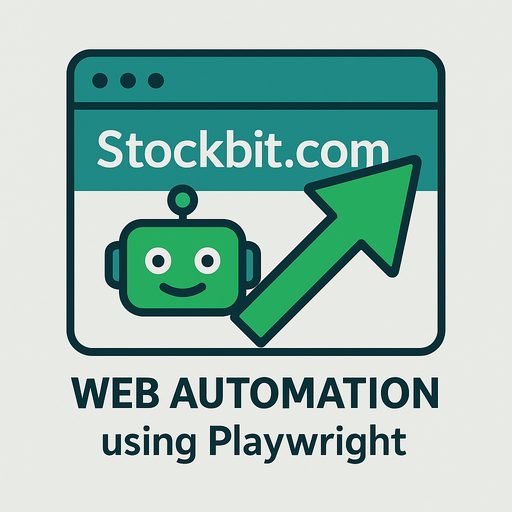

# Stockbit Playwright Web Automation

<p align="center">
  
</p>

This project is a Playwright-based test automation framework using Cucumber.js for Stockbit web platform.

| Version 2.0.0 introduces AI-powered testing capabilities through Stagehand integration.

Latest run example: [](https://github.com/elangbayu/pl-sb/actions/workflows/main.yml)

## Prerequisites

- Node.js (version >= 16)
- npm or yarn
- LLM API Key (⚠️ model must support structured outputs)

## Installation

1.  Clone the repository:

    ```bash
    git clone https://github.com/elangbayu/pl-sb.git
    ```

2.  Install the dependencies:

    ```bash
    npm install
    # or
    yarn install
    ```

3.  Set up your environment variables:

    ```bash
    export LLM_API_KEY=your_api_key_here
    export LLM_BASE_URL=your_base_url_here
    export LLM_MODEL_NAME=your_model_name_here
    # or create a .env file with those value
    ```

## Usage

### Running Tests

To run the tests, use the following command:

```bash
npm test
# or
yarn test
```

This will execute the Cucumber scenarios defined in the `features` directory and generate an HTML report in the `reports` directory.

### AI-Powered Testing Features

This version integrates Stagehand for AI-assisted testing capabilities:

- Automated element identification and interaction
- Smart assertions based on visual context
- Search functionality with AI-powered result validation
- Action observation and caching for improved performance

To use the AI features in your tests:

```javascript
// Example of using AI to interact with the page
await this.page.act("Type '1' into the order lot input");
await this.page.act("Click 'Order' button from the stock order modal");
```

### Linting

To run the linter, use the following command:

```bash
npm run lint
# or
yarn lint
```

This will check the code for any linting errors.

## Project Structure

```
pl-sb/
├── features/             # Feature files containing Cucumber scenarios
├── src/
│   ├── pages/            # Page object files
│   ├── components/       # Page object files for the component that is reusable in more than one page
│   ├── steps/            # Step definition files
│   ├── support/          # Support files (world, hooks, etc.)
│   └── ...
├── cucumber.js         # Cucumber configuration file
├── package.json        # Project dependencies and scripts
├── README.md           # This file
└── ...
```

## Contributing

Please feel free to contribute to this project by submitting pull requests.

## License

This project is licensed under the MIT License - see the [LICENSE](LICENSE) file for details.
